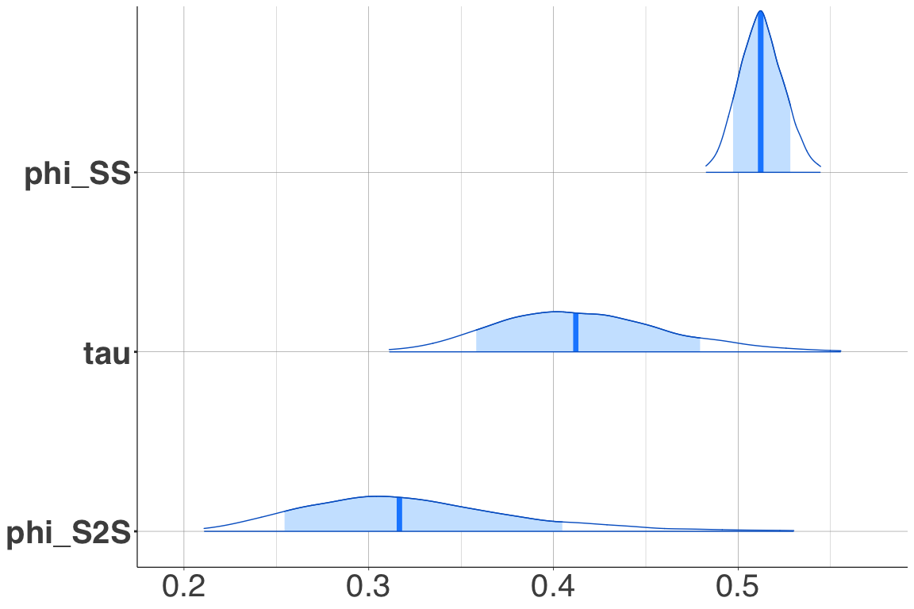

# Introduction

This is a tutorial on how to use the program Stan (<https://mc-stan.org/>) to estimate the parameters of a ground-motion model (GMM).
Stan is a program that uses Bayesian inference to estimate the parameters of a model via Markov Chain Monte Carlo (MCMC) sampling.

In this tutorial, we estimate parameters of a GMM used in Kuehn and Stafford.
A list of Sta programs covering a wide variety of GMMs is available in the other markdown file.

# Getting Started

This tutorial uses **Stan** version 2.24.1 and requires the following **R** packages

```r
# load required packages
library(lme4)
library(cmdstanr)
library(posterior)
library(bayesplot)

options(mc.cores = parallel::detectCores())
```


First, we define the color scheme for the bayesplot package, and tell the cmdStanR package where to find cmdStan.


```r
color_scheme_set("brightblue")

set_cmdstan_path('/Users/nico/GROUNDMOTION/SOFTWARE/cmdstan-2.24.1')
cmdstan_path()
cmdstan_version()
```

Next, we simulate some data.
Here, we have 50 events and 20 stations.
Each event is recorded at all 20 stations.
Events are randomly assigned a magnitude between 4 and 8, and an event term, sampled from a normal distribution with mea zero and standard deviation $\tau$.
Similarly, the $V_{S30}$ and station terms are randomly sampled for each station.
Then, for each event/station par, a distance is sampled, and the median PSA is calculated according to
$$y = c_1 + c_2 M + c_3 (8 - M)^2 + (c_4 + c_5 M) \ln \left[ R_{RUP} + h \right] + c_6 R_{RUP} + c_7 \ln \frac{V_{S30}}{400} + \delta B + \delta S + \delta WS$$


```r
## simulate data
tau <- 0.5;
phiSS <- 0.5;
phiS2S <- 0.4;

neq <- 50;
nstat <- 20;

### determine M, event term and observed magnitude
dataM <- matrix(nrow = neq,ncol=2);
set.seed(5618);
for(i in 1:neq) {
  mag <- round(runif(1,4,8),2);
  eta <- rnorm(1,0,tau);
  dataM[i,] <- c(mag,eta);
}

### determine VS, station term and observed VS
dataV <- matrix(nrow = nstat,ncol=2);
set.seed(8472);
for(i in 1:nstat) {
  vs <- round(runif(1,log(300),log(1000)),2);
  lambda <- rnorm(1,0,phiS2S);
  dataV[i,] <- c(vs - log(400),lambda);
}

nrec <- nstat;
data <- matrix(nrow=neq * nrec,ncol = 7);
data_x <- matrix(nrow = neq * nrec, ncol = 7)
data_y <- vector(length = neq * nrec)


h <- 6
coeffs <- c(10.925, -0.985, -0.245, -3.245, 0.32, -0.008, -0.5)

set.seed(98765);
k <- 1
for(i in 1:neq) {
  idx <- 1:nstat;
  mag <- dataM[i,1];
  eqt <- dataM[i,2];
  for(j in 1:nrec) {
    dist <- round(runif(1,1,200),2);
    epsilon <- rnorm(1,0,phiSS);
    
    vs <- dataV[idx[j],1];
    
    disteff <- dist + h;
    data_x[k,] <- c(1, mag, (8 - mag)^2, log(disteff), mag * log(disteff), dist, vs);
    pga <- coeffs %*% data_x[k,]
    pga2 <- pga + epsilon + eqt + dataV[idx[j],2];
    data_y[k] <- pga2;
    data[k,] <- c(mag,dist,vs,pga,pga2,i,idx[j]);
    k <- k+1;
  }
}
```


First, we fit a linear model using `lmer`, from the **R** package **lme4** [@Bates2015], to the data.
The package **lme4** is the successor to the package **nlme** and together these packages have been used quite extensively for the purposes of calibrating ground-motion models in the past.
These packages use more traditional maximum-likelihood based techniques with efficient numerical strategies to fit models. 
They are computationally very efficient, but also have limitations with regard to what type of models can be fit. 
To make our GMM linear, we have to fix the parameter `h` (often referred to as pseudo-depth of near-fault-saturation-term).
In this example, we fix it to `h = 6`, which is the value used to generate the data.


```r
eqid = data[,6]
statid = data[,7]
M <- data_x[,2]
M2 <- data_x[,3]
lnR <- data_x[,4]
MlnR <- data_x[,5]
R <- data_x[,6]
VS <- data_x[,7]
Y <- data_y

fit_lmer <- lmer(Y ~ 1 + M + M2 + lnR + MlnR + R + VS + (1 | eqid) + (1 | statid))
coeffs_lmer <- fixef(fit_lmer)
summary(fit_lmer)
```

```
## Linear mixed model fit by REML ['lmerMod']
## Formula: Y ~ 1 + M + M2 + lnR + MlnR + R + VS + (1 | eqid) + (1 | statid)
## 
## REML criterion at convergence: 1714.6
## 
## Scaled residuals: 
##     Min      1Q  Median      3Q     Max 
## -3.3116 -0.5857  0.0251  0.6254  2.9282 
## 
## Random effects:
##  Groups   Name        Variance Std.Dev.
##  eqid     (Intercept) 0.16305  0.4038  
##  statid   (Intercept) 0.09118  0.3020  
##  Residual             0.26218  0.5120  
## Number of obs: 1000, groups:  eqid, 50; statid, 20
## 
## Fixed effects:
##               Estimate Std. Error t value
## (Intercept) 11.1938460  1.7117234   6.540
## M           -0.9959825  0.2375447  -4.193
## M2          -0.2997963  0.0545729  -5.494
## lnR         -3.0961045  0.1505916 -20.560
## MlnR         0.2926556  0.0213087  13.734
## R           -0.0075606  0.0008187  -9.235
## VS          -0.5708701  0.1913181  -2.984
## 
## Correlation of Fixed Effects:
##      (Intr) M      M2     lnR    MlnR   R     
## M    -0.989                                   
## M2   -0.903  0.886                            
## lnR  -0.362  0.355 -0.014                     
## MlnR  0.346 -0.393  0.011 -0.909              
## R     0.115 -0.015  0.013 -0.444  0.061       
## VS   -0.041 -0.002  0.000 -0.006  0.006  0.001
```

# Stan

Now we describe how to fit the same model using Stan.
A Stan program is made up of blocks, like a `data {}`, `parameters {}` and a `model {}` block.
These are used to declare the data, the parameters to be estimated, and a generative model for the data.
A declaration of a variable will look like `real a;` to declare a variable `a` that is a real, or `vector[N] Y;` to declare a vector of length `N`.
Stan is typed, so there is a difference between a declaration `real a;` or `int a;`.
Constraints can be declared as `real<lower=L,upper=U> a;`, which means that `a` can take only values `L <= a <= U`.
Each line in a stan program has to end in `;`.


```r
file <- file.path('STAN', 'gmm.stan')
mod <- cmdstan_model(file)
```

```
## Model executable is up to date!
```

```r
mod$print()
```

```
##   data {
##     int<lower=1> N;      // number of records
##     int<lower=1> N_eq;   // number of earthquakes
##     int<lower=1> N_stat; // number of stations
##     int<lower=1> K;      // number of predictors
##     
##     matrix[N, K] X;      // matrix of predictors
##     vector[N] Y;
##     
##     int<lower=1,upper=N_eq> idx_eq[N];     // event index for each record
##     int<lower=1,upper=N_stat> idx_stat[N]; // station index for each record
##   }
##   
##   parameters {
##     vector[K] c;             // coefficients
##     
##     real<lower=0> phi_SS;    // standard deviation for within-event residuals
##     real<lower=0> phi_S2S;   // standard deviation of between-event residuals
##     real<lower=0> tau;       // standard deviation of site-to-site residuals
##     
##     vector[N_eq] deltaB;      // event terms
##     vector[N_stat] deltaS;    // station terms
##   }
##   
##   model {
##     // prior distributions
##     c ~ normal(0,10);
##     phi_SS ~ normal(0,1);
##     tau ~ normal(0,1);
##     phi_S2S ~ normal(0,1);
##     
##     deltaB ~ normal(0,tau);
##     deltaS ~ normal(0,phi_S2S);
##     
##     Y ~ normal(X * c + deltaB[idx_eq] + deltaS[idx_stat], phi_SS);
##   }
```

Next, we declare the data for the Stan program, and run the sampler.


```r
data_list <- list(N = length(data_y),
                  N_eq = neq,
                  N_stat = nstat,
                  K = 7,
                  X = data_x,
                  Y = data_y,
                  idx_eq = eqid,
                  idx_stat = statid
)

fit <- mod$sample(
  data = data_list,
  seed = 123,
  chains = 2,
  iter_sampling = 1000,
  iter_warmup = 1000,
  refresh = 500,
  max_treedepth = 12
)
```

```
## Running MCMC with 2 chains, at most 4 in parallel...
## 
## Chain 1 Iteration:    1 / 2000 [  0%]  (Warmup)
```

```
## Chain 1 Informational Message: The current Metropolis proposal is about to be rejected because of the following issue:
```

```
## Chain 1 Exception: normal_lpdf: Scale parameter is 0, but must be > 0! (in '/var/folders/p3/r7vrsk6n2d15709vgcky_y880000gn/T/Rtmp8pWeRx/model-ee4a600539.stan', line 32, column 4 to column 27)
```

```
## Chain 1 If this warning occurs sporadically, such as for highly constrained variable types like covariance matrices, then the sampler is fine,
```

```
## Chain 1 but if this warning occurs often then your model may be either severely ill-conditioned or misspecified.
```

```
## Chain 1
```

```
## Chain 2 Iteration:    1 / 2000 [  0%]  (Warmup)
```

```
## Chain 2 Informational Message: The current Metropolis proposal is about to be rejected because of the following issue:
```

```
## Chain 2 Exception: normal_lpdf: Scale parameter is 0, but must be > 0! (in '/var/folders/p3/r7vrsk6n2d15709vgcky_y880000gn/T/Rtmp8pWeRx/model-ee4a600539.stan', line 32, column 4 to column 27)
```

```
## Chain 2 If this warning occurs sporadically, such as for highly constrained variable types like covariance matrices, then the sampler is fine,
```

```
## Chain 2 but if this warning occurs often then your model may be either severely ill-conditioned or misspecified.
```

```
## Chain 2
```

```
## Chain 1 Iteration:  500 / 2000 [ 25%]  (Warmup) 
## Chain 2 Iteration:  500 / 2000 [ 25%]  (Warmup) 
## Chain 1 Iteration: 1000 / 2000 [ 50%]  (Warmup) 
## Chain 1 Iteration: 1001 / 2000 [ 50%]  (Sampling) 
## Chain 2 Iteration: 1000 / 2000 [ 50%]  (Warmup) 
## Chain 2 Iteration: 1001 / 2000 [ 50%]  (Sampling) 
## Chain 1 Iteration: 1500 / 2000 [ 75%]  (Sampling) 
## Chain 2 Iteration: 1500 / 2000 [ 75%]  (Sampling) 
## Chain 1 Iteration: 2000 / 2000 [100%]  (Sampling) 
## Chain 1 finished in 180.2 seconds.
## Chain 2 Iteration: 2000 / 2000 [100%]  (Sampling) 
## Chain 2 finished in 180.3 seconds.
## 
## Both chains finished successfully.
## Mean chain execution time: 180.2 seconds.
## Total execution time: 180.4 seconds.
```

The output of running `mod$sample()` is a `CmdStanMCMC`.
We can use the associated `print` method to get a summary of the fit.


```r
fit$print(variables = c('c','phi_SS', 'tau', 'phi_S2S'))
```

```
##  variable  mean median   sd  mad    q5   q95 rhat ess_bulk ess_tail
##   c[1]    10.91  10.93 1.72 1.71  8.02 13.66 1.00      247      401
##   c[2]    -0.96  -0.96 0.24 0.23 -1.35 -0.56 1.00      258      386
##   c[3]    -0.29  -0.29 0.05 0.05 -0.38 -0.20 1.00      248      442
##   c[4]    -3.09  -3.09 0.15 0.15 -3.34 -2.83 1.00     1028     1143
##   c[5]     0.29   0.29 0.02 0.02  0.25  0.33 1.00     1069     1017
##   c[6]    -0.01  -0.01 0.00 0.00 -0.01 -0.01 1.00     2015     1595
##   c[7]    -0.56  -0.56 0.21 0.21 -0.91 -0.22 1.01      190      494
##   phi_SS   0.51   0.51 0.01 0.01  0.49  0.53 1.00     2412     1455
##   tau      0.41   0.41 0.05 0.05  0.34  0.50 1.00     1542     1563
##   phi_S2S  0.32   0.32 0.06 0.06  0.24  0.43 1.00     1201      918
```

As we can see, the Rhat values are all close to one, indicating good convergence of the chains.
Below, we plot trace plots of the chains for the standard deviation parameters.


```r
posterior <- fit$draws()
mcmc_trace(posterior, regex_pars = c("phi_SS", "tau", "phi_S2S")) +
  xaxis_title(size = 30, family = "sans") + 
  yaxis_title(size = 30, family = "sans")
```

<!-- -->

Histograms of the parameters show the uncertainty associaed with each parameter.


```r
mcmc_hist(posterior, regex_pars = c("c")) +
  xaxis_title(size = 30, family = "sans") + 
  yaxis_title(size = 30, family = "sans")
```

```
## `stat_bin()` using `bins = 30`. Pick better value with `binwidth`.
```

<!-- -->

```r
mcmc_hist(posterior, regex_pars = c("phi_SS", "tau", "phi_S2S")) +
  xaxis_title(size = 30, family = "sans") + 
  yaxis_title(size = 30, family = "sans")
```

```
## `stat_bin()` using `bins = 30`. Pick better value with `binwidth`.
```

<!-- -->


```r
mcmc_intervals(posterior, regex_pars = c("phi_SS", "tau", "phi_S2S")) +
  xaxis_text(size = 30, family = "sans") + 
  yaxis_text(size = 30, family = "sans") +
  grid_lines(color = "gray60")
```

<!-- -->

```r
mcmc_areas(posterior,
           regex_pars = c("phi_SS", "tau", "phi_S2S"),
           prob = 0.8,
           prob_outer = 0.99) +
  xaxis_text(size = 30, family = "sans") + 
  yaxis_text(size = 30, family = "sans") +
  grid_lines(color = "gray60")
```

<!-- -->


```r
mcmc_intervals(posterior, regex_pars = c("deltaS"),
               prob = 0.84, prob_outer = 0.95) +
  xaxis_text(size = 30, family = "sans") + 
  yaxis_text(size = 30, family = "sans") +
  grid_lines(color = "gray60")
```

<!-- -->
