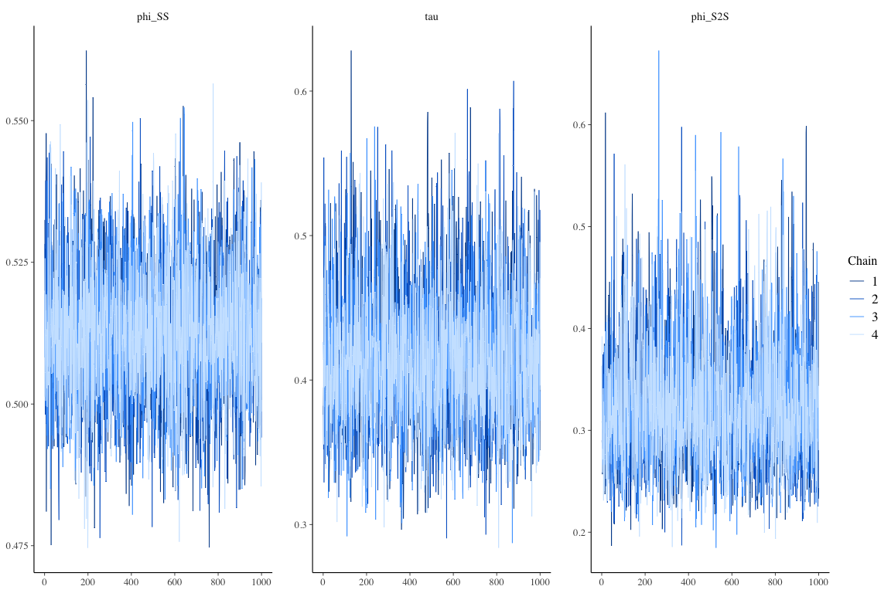
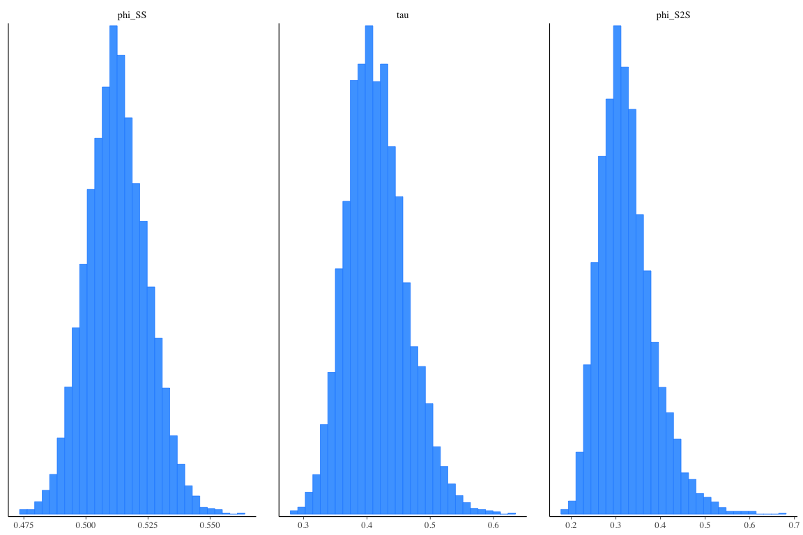
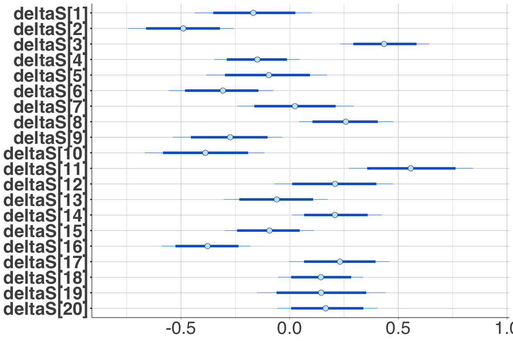
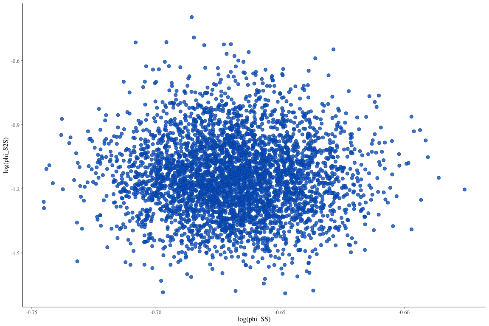

# Introduction

This is a tutorial on how to use the program Stan (<https://mc-stan.org/>) to estimate the parameters of a ground-motion model (GMM).
Stan is a program that uses Bayesian inference to estimate the parameters of a model via Markov Chain Monte Carlo (MCMC) sampling.

In this tutorial, we estimate parameters of a GMM used as an example in Kuehn and Stafford.
A list of Stan programs covering a wide variety of GMMs is available in the other markdown file.
We will use he package `cmdstanR` to estimate the model parameters, sine it is a lightweight package that allows to use the lates Stan version.
We cover the basics of running the model and extracting parameters/posterior distributions, and looking at graphical summaries.
For more info and installation instructions, see <https://mc-stan.org/cmdstanr/> and the vignette <https://mc-stan.org/cmdstanr/articles/cmdstanr.html>.
For the use of the package Rstan, see <https://mc-stan.org/rstan/>.

# Getting Started

This tutorial uses **Stan** version 2.27.0 and requires the following **R** packages.

```r
# load required packages
library(lme4)
library(cmdstanr)
library(posterior)
library(bayesplot)
library(ggplot2)

options(mc.cores = parallel::detectCores())
```


First, we define the color scheme for the bayesplot package, and tell the cmdStanR package where to find cmdStan.


```r
color_scheme_set("brightblue")

set_cmdstan_path('/Users/nico/GROUNDMOTION/SOFTWARE/cmdstan-2.27.0') # replace with Path 
cmdstan_path()
cmdstan_version()
```

Next, we simulate some data.
Here, we have 50 events and 20 stations.
Each event is recorded at all 20 stations.
Events are randomly assigned a magnitude between 4 and 8, and an event term, sampled from a normal distribution with mea zero and standard deviation $\tau$.
Similarly, the $V_{S30}$ and station terms are randomly sampled for each station.
Then, for each event/station par, a distance is sampled, and the median PSA is calculated according to
$$y = c_1 + c_2 M + c_3 (8 - M)^2 + (c_4 + c_5 M) \ln \left[ R_{RUP} + h \right] + c_6 R_{RUP} + c_7 \ln \frac{V_{S30}}{400} + \delta B + \delta S + \delta WS$$


```r
## simulate data
tau <- 0.5;
phiSS <- 0.5;
phiS2S <- 0.4;

neq <- 50;
nstat <- 20;

### determine M, event term and observed magnitude
dataM <- matrix(nrow = neq,ncol=2);
set.seed(5618);
for(i in 1:neq) {
  mag <- round(runif(1,4,8),2);
  eta <- rnorm(1,0,tau);
  dataM[i,] <- c(mag,eta);
}

### determine VS, station term and observed VS
dataV <- matrix(nrow = nstat,ncol=2);
set.seed(8472);
for(i in 1:nstat) {
  vs <- round(runif(1,log(300),log(1000)),2);
  lambda <- rnorm(1,0,phiS2S);
  dataV[i,] <- c(vs - log(400),lambda);
}

nrec <- nstat;
data <- matrix(nrow=neq * nrec,ncol = 7);
data_x <- matrix(nrow = neq * nrec, ncol = 7)
data_y <- vector(length = neq * nrec)


h <- 6
coeffs <- c(10.925, -0.985, -0.245, -3.245, 0.32, -0.008, -0.5)

set.seed(98765);
k <- 1
for(i in 1:neq) {
  idx <- 1:nstat;
  mag <- dataM[i,1];
  eqt <- dataM[i,2];
  for(j in 1:nrec) {
    dist <- round(runif(1,1,200),2);
    epsilon <- rnorm(1,0,phiSS);
    
    vs <- dataV[idx[j],1];
    
    disteff <- dist + h;
    data_x[k,] <- c(1, mag, (8 - mag)^2, log(disteff), mag * log(disteff), dist, vs);
    pga <- coeffs %*% data_x[k,]
    pga2 <- pga + epsilon + eqt + dataV[idx[j],2];
    data_y[k] <- pga2;
    data[k,] <- c(mag,dist,vs,pga,pga2,i,idx[j]);
    k <- k+1;
  }
}
```


First, we fit a linear model using `lmer`, from the **R** package **lme4** [@Bates2015], to the data.
The package **lme4** is the successor to the package **nlme** and together these packages have been used quite extensively for the purposes of calibrating ground-motion models in the past.
These packages use more traditional maximum-likelihood based techniques with efficient numerical strategies to fit models. 
They are computationally very efficient, but also have limitations with regard to what type of models can be fit. 
To make our GMM linear, we have to fix the parameter `h` (often referred to as pseudo-depth of near-fault-saturation-term).
In this example, we fix it to `h = 6`, which is the value used to generate the data.


```r
eqid = data[,6]
statid = data[,7]
M <- data_x[,2]
M2 <- data_x[,3]
lnR <- data_x[,4]
MlnR <- data_x[,5]
R <- data_x[,6]
VS <- data_x[,7]
Y <- data_y

fit_lmer <- lmer(Y ~ 1 + M + M2 + lnR + MlnR + R + VS + (1 | eqid) + (1 | statid))
coeffs_lmer <- fixef(fit_lmer)
summary(fit_lmer)
```

```
## Linear mixed model fit by REML ['lmerMod']
## Formula: Y ~ 1 + M + M2 + lnR + MlnR + R + VS + (1 | eqid) + (1 | statid)
## 
## REML criterion at convergence: 1714.6
## 
## Scaled residuals: 
##     Min      1Q  Median      3Q     Max 
## -3.3116 -0.5857  0.0251  0.6254  2.9282 
## 
## Random effects:
##  Groups   Name        Variance Std.Dev.
##  eqid     (Intercept) 0.16305  0.4038  
##  statid   (Intercept) 0.09118  0.3020  
##  Residual             0.26218  0.5120  
## Number of obs: 1000, groups:  eqid, 50; statid, 20
## 
## Fixed effects:
##               Estimate Std. Error t value
## (Intercept) 11.1938460  1.7117234   6.540
## M           -0.9959825  0.2375447  -4.193
## M2          -0.2997963  0.0545729  -5.494
## lnR         -3.0961045  0.1505916 -20.560
## MlnR         0.2926556  0.0213087  13.734
## R           -0.0075606  0.0008187  -9.235
## VS          -0.5708701  0.1913181  -2.984
## 
## Correlation of Fixed Effects:
##      (Intr) M      M2     lnR    MlnR   R     
## M    -0.989                                   
## M2   -0.903  0.886                            
## lnR  -0.362  0.355 -0.014                     
## MlnR  0.346 -0.393  0.011 -0.909              
## R     0.115 -0.015  0.013 -0.444  0.061       
## VS   -0.041 -0.002  0.000 -0.006  0.006  0.001
```

# Stan

Now we describe how to fit the same model using Stan.
A Stan program is made up of blocks, like a `data {}`, `parameters {}` and a `model {}` block.
These are used to declare the data, the parameters to be estimated, and a generative model for the data.
A declaration of a variable will look like `real a;` to declare a variable `a` that is a real, or `vector[N] Y;` to declare a vector of length `N`.
Stan is typed, so there is a difference between a declaration `real a;` or `int a;`.
Constraints can be declared as `real<lower=L,upper=U> a;`, which means that `a` can take only values `L <= a <= U`.
Each line in a stan program has to end in `;`.

Below, we load a Stan model from file `STAN/gmm.stan`.
It is compiled with `mod <- cmdstan_model(file)`, which returns a `CmdStanModel` object, which can be used to access information about the model, and provides methods to for fitting the model. 


```r
file <- file.path('STAN', 'gmm.stan')
mod <- cmdstan_model(file)
```

```
## Model executable is up to date!
```

```r
mod$print()
```

```
##   data {
##     int<lower=1> N;      // number of records
##     int<lower=1> N_eq;   // number of earthquakes
##     int<lower=1> N_stat; // number of stations
##     int<lower=1> K;      // number of predictors
##     
##     matrix[N, K] X;      // matrix of predictors
##     vector[N] Y;
##     
##     int<lower=1,upper=N_eq> idx_eq[N];     // event index for each record
##     int<lower=1,upper=N_stat> idx_stat[N]; // station index for each record
##   }
##   
##   parameters {
##     vector[K] c;             // coefficients
##     
##     real<lower=0> phi_SS;    // standard deviation for within-event residuals
##     real<lower=0> phi_S2S;   // standard deviation of between-event residuals
##     real<lower=0> tau;       // standard deviation of site-to-site residuals
##     
##     vector[N_eq] deltaB;      // event terms
##     vector[N_stat] deltaS;    // station terms
##   }
##   
##   model {
##     // prior distributions
##     c ~ normal(0,10);
##     phi_SS ~ normal(0,1);
##     tau ~ normal(0,1);
##     phi_S2S ~ normal(0,1);
##     
##     deltaB ~ normal(0,tau);
##     deltaS ~ normal(0,phi_S2S);
##     
##     Y ~ normal(X * c + deltaB[idx_eq] + deltaS[idx_stat], phi_SS);
##   }
```

## cmdstanR

Next, we declare the data for the Stan program, and run the sampler.
All parameters declared in the `data {}` block are defined as a named list in **R**.
Then, the `$sample()` method is used to call the MCMC sampler.
There are options that allow one to control the sampling process, such as setting the number of chains to run, the number of warm-up samples and post-warmup samples, and others.
For a full list of options, see <https://mc-stan.org/cmdstanr/reference/model-method-sample.html>.


```r
data_list <- list(N = length(data_y),
                  N_eq = neq,
                  N_stat = nstat,
                  K = 7,
                  X = data_x,
                  Y = data_y,
                  idx_eq = eqid,
                  idx_stat = statid
)

fit <- mod$sample(
  data = data_list,
  seed = 123,
  chains = 4,
  iter_sampling = 1000,
  iter_warmup = 1000,
  refresh = 500,
  max_treedepth = 12
)
```

```
## Running MCMC with 4 parallel chains...
## 
## Chain 1 Iteration:    1 / 2000 [  0%]  (Warmup)
```

```
## Chain 1 Informational Message: The current Metropolis proposal is about to be rejected because of the following issue:
```

```
## Chain 1 Exception: normal_lpdf: Scale parameter is 0, but must be positive! (in '/var/folders/p3/r7vrsk6n2d15709vgcky_y880000gn/T/Rtmpp63mtu/model-200431ce3d4a.stan', line 32, column 4 to column 27)
```

```
## Chain 1 If this warning occurs sporadically, such as for highly constrained variable types like covariance matrices, then the sampler is fine,
```

```
## Chain 1 but if this warning occurs often then your model may be either severely ill-conditioned or misspecified.
```

```
## Chain 1
```

```
## Chain 2 Iteration:    1 / 2000 [  0%]  (Warmup)
```

```
## Chain 2 Informational Message: The current Metropolis proposal is about to be rejected because of the following issue:
```

```
## Chain 2 Exception: normal_lpdf: Scale parameter is 0, but must be positive! (in '/var/folders/p3/r7vrsk6n2d15709vgcky_y880000gn/T/Rtmpp63mtu/model-200431ce3d4a.stan', line 32, column 4 to column 27)
```

```
## Chain 2 If this warning occurs sporadically, such as for highly constrained variable types like covariance matrices, then the sampler is fine,
```

```
## Chain 2 but if this warning occurs often then your model may be either severely ill-conditioned or misspecified.
```

```
## Chain 2
```

```
## Chain 3 Iteration:    1 / 2000 [  0%]  (Warmup) 
## Chain 4 Iteration:    1 / 2000 [  0%]  (Warmup) 
## Chain 4 Iteration:  500 / 2000 [ 25%]  (Warmup) 
## Chain 3 Iteration:  500 / 2000 [ 25%]  (Warmup) 
## Chain 2 Iteration:  500 / 2000 [ 25%]  (Warmup) 
## Chain 1 Iteration:  500 / 2000 [ 25%]  (Warmup) 
## Chain 4 Iteration: 1000 / 2000 [ 50%]  (Warmup) 
## Chain 4 Iteration: 1001 / 2000 [ 50%]  (Sampling) 
## Chain 3 Iteration: 1000 / 2000 [ 50%]  (Warmup) 
## Chain 3 Iteration: 1001 / 2000 [ 50%]  (Sampling) 
## Chain 1 Iteration: 1000 / 2000 [ 50%]  (Warmup) 
## Chain 1 Iteration: 1001 / 2000 [ 50%]  (Sampling) 
## Chain 2 Iteration: 1000 / 2000 [ 50%]  (Warmup) 
## Chain 2 Iteration: 1001 / 2000 [ 50%]  (Sampling) 
## Chain 4 Iteration: 1500 / 2000 [ 75%]  (Sampling) 
## Chain 3 Iteration: 1500 / 2000 [ 75%]  (Sampling) 
## Chain 2 Iteration: 1500 / 2000 [ 75%]  (Sampling) 
## Chain 1 Iteration: 1500 / 2000 [ 75%]  (Sampling) 
## Chain 4 Iteration: 2000 / 2000 [100%]  (Sampling) 
## Chain 4 finished in 290.6 seconds.
## Chain 3 Iteration: 2000 / 2000 [100%]  (Sampling) 
## Chain 3 finished in 293.9 seconds.
## Chain 2 Iteration: 2000 / 2000 [100%]  (Sampling) 
## Chain 2 finished in 310.2 seconds.
## Chain 1 Iteration: 2000 / 2000 [100%]  (Sampling) 
## Chain 1 finished in 313.6 seconds.
## 
## All 4 chains finished successfully.
## Mean chain execution time: 302.1 seconds.
## Total execution time: 313.8 seconds.
```


### Assessing the Model Fit

Next, we do some checks to see whether there were some problems with the fit.
To understand wome of these diagnostices, see @Vehtari2020 (for Rhat) and @Betancourt2016 (for EBFMI (Energy Bayesian fraction of missing information)).


```r
fit$cmdstan_diagnose()
```

```
## Processing csv files: /var/folders/p3/r7vrsk6n2d15709vgcky_y880000gn/T/RtmpbsH4qM/gmm-202108131220-1-807f05.csv, /var/folders/p3/r7vrsk6n2d15709vgcky_y880000gn/T/RtmpbsH4qM/gmm-202108131220-2-807f05.csv, /var/folders/p3/r7vrsk6n2d15709vgcky_y880000gn/T/RtmpbsH4qM/gmm-202108131220-3-807f05.csv, /var/folders/p3/r7vrsk6n2d15709vgcky_y880000gn/T/RtmpbsH4qM/gmm-202108131220-4-807f05.csv
## 
## Checking sampler transitions treedepth.
## Treedepth satisfactory for all transitions.
## 
## Checking sampler transitions for divergences.
## No divergent transitions found.
## 
## Checking E-BFMI - sampler transitions HMC potential energy.
## E-BFMI satisfactory.
## 
## Effective sample size satisfactory.
## 
## Split R-hat values satisfactory all parameters.
## 
## Processing complete, no problems detected.
```


```r
fit$cmdstan_summary()
```

```
## Inference for Stan model: gmm_model
## 4 chains: each with iter=(1000,1000,1000,1000); warmup=(0,0,0,0); thin=(1,1,1,1); 4000 iterations saved.
## 
## Warmup took (160, 167, 137, 134) seconds, 10.0 minutes total
## Sampling took (154, 143, 157, 157) seconds, 10 minutes total
## 
##                     Mean     MCSE   StdDev        5%       50%       95%    N_Eff  N_Eff/s    R_hat
## 
## lp__             2.0e+02  1.8e-01  6.6e+00   1.9e+02   2.0e+02   2.1e+02     1379      2.3      1.0
## accept_stat__    9.3e-01  7.0e-03  9.3e-02   7.3e-01   9.7e-01   1.0e+00  1.7e+02  2.9e-01  1.0e+00
## stepsize__       6.5e-03  4.9e-04  6.9e-04   5.3e-03   7.0e-03   7.1e-03  2.0e+00  3.3e-03  3.7e+13
## treedepth__      9.0e+00  5.1e-03  1.2e-01   9.0e+00   9.0e+00   9.0e+00  5.2e+02  8.4e-01      nan
## n_leapfrog__     5.4e+02  1.4e+01  1.3e+02   5.1e+02   5.1e+02   5.1e+02  9.4e+01  1.5e-01  1.0e+00
## divergent__      0.0e+00      nan  0.0e+00   0.0e+00   0.0e+00   0.0e+00      nan      nan      nan
## energy__        -1.6e+02  2.6e-01  9.2e+00  -1.7e+02  -1.6e+02  -1.4e+02  1.3e+03  2.1e+00  1.0e+00
## 
## c[1]             1.1e+01  9.0e-02  1.7e+00   8.2e+00   1.1e+01   1.4e+01      342     0.56      1.0
## c[2]            -9.5e-01  1.2e-02  2.3e-01  -1.3e+00  -9.5e-01  -5.8e-01      347     0.57      1.0
## c[3]            -2.9e-01  3.0e-03  5.4e-02  -3.8e-01  -2.9e-01  -2.0e-01      318     0.52      1.0
## c[4]            -3.1e+00  3.6e-03  1.5e-01  -3.3e+00  -3.1e+00  -2.8e+00     1803      3.0      1.0
## c[5]             2.9e-01  5.1e-04  2.2e-02   2.5e-01   2.9e-01   3.3e-01     1774      2.9      1.0
## c[6]            -7.6e-03  1.2e-05  8.2e-04  -8.9e-03  -7.6e-03  -6.2e-03     4589      7.5     1.00
## c[7]            -5.6e-01  8.9e-03  2.1e-01  -9.1e-01  -5.6e-01  -2.2e-01      548     0.90      1.0
## phi_SS           5.1e-01  1.9e-04  1.2e-02   4.9e-01   5.1e-01   5.3e-01     3955      6.5      1.0
## phi_S2S          3.2e-01  1.2e-03  6.0e-02   2.4e-01   3.2e-01   4.4e-01     2608      4.3     1.00
## tau              4.2e-01  9.2e-04  4.7e-02   3.4e-01   4.1e-01   5.0e-01     2634      4.3      1.0
## deltaB[1]        5.7e-01  4.2e-03  1.3e-01   3.6e-01   5.8e-01   7.9e-01      988      1.6      1.0
## deltaB[2]        5.5e-01  4.2e-03  1.3e-01   3.3e-01   5.5e-01   7.7e-01     1000      1.6      1.0
## deltaB[3]       -9.5e-02  4.1e-03  1.3e-01  -3.1e-01  -9.5e-02   1.2e-01     1052      1.7      1.0
## deltaB[4]        4.6e-01  4.3e-03  1.3e-01   2.4e-01   4.6e-01   6.8e-01      966      1.6      1.0
## deltaB[5]        3.4e-01  4.4e-03  1.3e-01   1.2e-01   3.4e-01   5.6e-01      893      1.5      1.0
## deltaB[6]        1.6e-01  6.8e-03  1.7e-01  -1.2e-01   1.7e-01   4.5e-01      640      1.0      1.0
## deltaB[7]        2.4e-01  4.9e-03  1.4e-01   1.4e-02   2.4e-01   4.7e-01      813      1.3      1.0
## deltaB[8]       -2.5e-01  6.0e-03  1.7e-01  -5.2e-01  -2.5e-01   2.2e-02      771      1.3      1.0
## deltaB[9]       -2.2e-02  4.7e-03  1.4e-01  -2.5e-01  -1.8e-02   1.9e-01      839      1.4      1.0
## deltaB[10]      -4.1e-01  7.1e-03  1.8e-01  -7.0e-01  -4.1e-01  -1.2e-01      625      1.0      1.0
## deltaB[11]      -3.5e-01  4.5e-03  1.4e-01  -5.7e-01  -3.5e-01  -1.3e-01      905      1.5      1.0
## deltaB[12]       2.2e-01  7.4e-03  1.8e-01  -8.9e-02   2.2e-01   5.2e-01      618      1.0      1.0
## deltaB[13]      -4.8e-01  4.8e-03  1.4e-01  -7.1e-01  -4.7e-01  -2.6e-01      811      1.3      1.0
## deltaB[14]      -1.4e-01  4.3e-03  1.4e-01  -3.6e-01  -1.4e-01   7.7e-02      999      1.6      1.0
## deltaB[15]       4.8e-01  6.0e-03  1.6e-01   2.1e-01   4.8e-01   7.5e-01      731      1.2      1.0
## deltaB[16]       1.6e-02  5.2e-03  1.5e-01  -2.3e-01   1.9e-02   2.6e-01      842      1.4     1.00
## deltaB[17]       4.4e-01  5.2e-03  1.5e-01   1.9e-01   4.4e-01   6.8e-01      813      1.3      1.0
## deltaB[18]      -4.9e-01  4.0e-03  1.3e-01  -7.0e-01  -4.9e-01  -2.7e-01     1072      1.8      1.0
## deltaB[19]       6.9e-01  4.1e-03  1.3e-01   4.7e-01   6.9e-01   9.0e-01     1040      1.7      1.0
## deltaB[20]      -1.5e-01  4.7e-03  1.4e-01  -3.8e-01  -1.5e-01   7.1e-02      857      1.4      1.0
## deltaB[21]      -3.7e-01  5.9e-03  1.6e-01  -6.3e-01  -3.7e-01  -1.1e-01      711      1.2      1.0
## deltaB[22]      -1.6e-01  6.4e-03  1.7e-01  -4.5e-01  -1.6e-01   1.2e-01      736      1.2      1.0
## deltaB[23]       7.6e-01  4.3e-03  1.3e-01   5.4e-01   7.6e-01   9.8e-01      963      1.6      1.0
## deltaB[24]      -2.3e-01  5.0e-03  1.3e-01  -4.5e-01  -2.3e-01  -1.5e-02      725      1.2      1.0
## deltaB[25]       3.9e-01  4.2e-03  1.4e-01   1.5e-01   3.9e-01   6.2e-01     1158      1.9      1.0
## deltaB[26]       5.6e-01  9.2e-03  2.2e-01   2.1e-01   5.6e-01   9.3e-01      568     0.93      1.0
## deltaB[27]       1.1e-01  4.5e-03  1.3e-01  -1.1e-01   1.1e-01   3.4e-01      869      1.4      1.0
## deltaB[28]      -2.4e-01  4.5e-03  1.3e-01  -4.6e-01  -2.4e-01  -1.6e-02      854      1.4      1.0
## deltaB[29]      -3.6e-01  4.0e-03  1.3e-01  -5.9e-01  -3.6e-01  -1.4e-01     1098      1.8      1.0
## deltaB[30]      -2.4e-01  4.9e-03  1.4e-01  -4.7e-01  -2.4e-01  -1.4e-02      792      1.3      1.0
## deltaB[31]       2.1e-01  5.9e-03  1.7e-01  -5.8e-02   2.1e-01   4.9e-01      775      1.3      1.0
## deltaB[32]      -7.7e-01  4.0e-03  1.3e-01  -9.9e-01  -7.7e-01  -5.6e-01     1057      1.7      1.0
## deltaB[33]      -3.5e-01  7.0e-03  1.7e-01  -6.4e-01  -3.5e-01  -5.9e-02      629      1.0      1.0
## deltaB[34]      -3.0e-01  4.1e-03  1.3e-01  -5.2e-01  -3.0e-01  -8.2e-02     1061      1.7      1.0
## deltaB[35]      -7.1e-02  4.0e-03  1.3e-01  -2.9e-01  -7.2e-02   1.5e-01     1098      1.8      1.0
## deltaB[36]      -1.2e-01  4.6e-03  1.4e-01  -3.5e-01  -1.2e-01   1.1e-01      913      1.5      1.0
## deltaB[37]       6.4e-02  4.7e-03  1.4e-01  -1.6e-01   6.2e-02   2.9e-01      858      1.4      1.0
## deltaB[38]       3.1e-02  5.7e-03  1.6e-01  -2.3e-01   2.9e-02   2.9e-01      800      1.3      1.0
## deltaB[39]      -7.8e-01  6.0e-03  1.7e-01  -1.0e+00  -7.7e-01  -5.0e-01      748      1.2      1.0
## deltaB[40]       2.3e-01  5.1e-03  1.5e-01  -1.4e-02   2.3e-01   4.8e-01      878      1.4      1.0
## deltaB[41]       8.5e-02  5.7e-03  1.6e-01  -1.8e-01   8.5e-02   3.5e-01      778      1.3      1.0
## deltaB[42]       3.6e-02  4.7e-03  1.4e-01  -1.9e-01   3.6e-02   2.6e-01      842      1.4      1.0
## deltaB[43]       6.9e-02  4.8e-03  1.4e-01  -1.6e-01   6.9e-02   3.0e-01      838      1.4      1.0
## deltaB[44]      -7.3e-01  4.5e-03  1.4e-01  -9.6e-01  -7.3e-01  -5.0e-01      993      1.6      1.0
## deltaB[45]      -3.4e-01  4.3e-03  1.4e-01  -5.7e-01  -3.4e-01  -1.2e-01      991      1.6      1.0
## deltaB[46]       5.3e-01  4.5e-03  1.4e-01   3.0e-01   5.3e-01   7.6e-01      924      1.5      1.0
## deltaB[47]      -2.8e-01  7.9e-03  1.9e-01  -5.9e-01  -2.8e-01   3.2e-02      582     0.95      1.0
## deltaB[48]       1.3e-01  4.2e-03  1.3e-01  -8.3e-02   1.3e-01   3.5e-01      978      1.6      1.0
## deltaB[49]      -1.2e-01  4.5e-03  1.4e-01  -3.4e-01  -1.2e-01   1.1e-01      929      1.5      1.0
## deltaB[50]       3.9e-01  4.8e-03  1.4e-01   1.6e-01   3.9e-01   6.2e-01      827      1.4      1.0
## deltaS[1]       -1.7e-01  4.9e-03  1.4e-01  -3.9e-01  -1.7e-01   5.7e-02      773      1.3      1.0
## deltaS[2]       -4.9e-01  5.5e-03  1.2e-01  -7.0e-01  -4.9e-01  -2.9e-01      494     0.81      1.0
## deltaS[3]        4.4e-01  3.3e-03  1.0e-01   2.7e-01   4.3e-01   6.1e-01      995      1.6      1.0
## deltaS[4]       -1.5e-01  3.2e-03  1.0e-01  -3.1e-01  -1.5e-01   1.1e-02      993      1.6      1.0
## deltaS[5]       -1.0e-01  6.6e-03  1.4e-01  -3.4e-01  -9.6e-02   1.3e-01      447     0.73      1.0
## deltaS[6]       -3.1e-01  5.4e-03  1.2e-01  -5.1e-01  -3.1e-01  -1.1e-01      509     0.83      1.0
## deltaS[7]        2.4e-02  4.9e-03  1.4e-01  -2.0e-01   2.4e-02   2.5e-01      762      1.2      1.0
## deltaS[8]        2.6e-01  3.6e-03  1.1e-01   7.5e-02   2.6e-01   4.3e-01      958      1.6      1.0
## deltaS[9]       -2.8e-01  5.6e-03  1.3e-01  -4.9e-01  -2.7e-01  -7.4e-02      503     0.82      1.0
## deltaS[10]      -3.9e-01  5.2e-03  1.4e-01  -6.2e-01  -3.9e-01  -1.6e-01      743      1.2      1.0
## deltaS[11]       5.6e-01  6.6e-03  1.5e-01   3.2e-01   5.6e-01   8.0e-01      481     0.79      1.0
## deltaS[12]       2.1e-01  6.4e-03  1.4e-01  -2.7e-02   2.1e-01   4.3e-01      474     0.78      1.0
## deltaS[13]      -6.2e-02  4.9e-03  1.2e-01  -2.7e-01  -6.0e-02   1.4e-01      606     0.99      1.0
## deltaS[14]       2.1e-01  3.4e-03  1.1e-01   3.9e-02   2.1e-01   3.9e-01      957      1.6      1.0
## deltaS[15]      -9.4e-02  3.3e-03  1.0e-01  -2.7e-01  -9.3e-02   7.4e-02      994      1.6      1.0
## deltaS[16]      -3.8e-01  3.7e-03  1.0e-01  -5.5e-01  -3.8e-01  -2.1e-01      775      1.3      1.0
## deltaS[17]       2.3e-01  5.5e-03  1.2e-01   3.8e-02   2.3e-01   4.2e-01      464     0.76      1.0
## deltaS[18]       1.4e-01  3.3e-03  9.9e-02  -1.6e-02   1.4e-01   3.1e-01      893      1.5      1.0
## deltaS[19]       1.5e-01  5.5e-03  1.5e-01  -9.7e-02   1.4e-01   3.9e-01      739      1.2      1.0
## deltaS[20]       1.7e-01  4.0e-03  1.2e-01  -2.2e-02   1.7e-01   3.6e-01      894      1.5      1.0
## 
## Samples were drawn using hmc with nuts.
## For each parameter, N_Eff is a crude measure of effective sample size,
## and R_hat is the potential scale reduction factor on split chains (at 
## convergence, R_hat=1).
```

The output of running `mod$sample()` is a `CmdStanMCMC` object.
We can use the associated `print` method to get a summary of the fit.


```r
fit$print(variables = c('c','phi_SS', 'tau', 'phi_S2S'))
```

```
##  variable  mean median   sd  mad    q5   q95 rhat ess_bulk ess_tail
##   c[1]    10.85  10.84 1.67 1.72  8.17 13.54 1.00      349      503
##   c[2]    -0.95  -0.95 0.23 0.24 -1.33 -0.58 1.00      353      598
##   c[3]    -0.29  -0.29 0.05 0.06 -0.38 -0.20 1.01      322      647
##   c[4]    -3.08  -3.09 0.15 0.15 -3.33 -2.82 1.00     1842     2321
##   c[5]     0.29   0.29 0.02 0.02  0.25  0.33 1.00     1800     2486
##   c[6]    -0.01  -0.01 0.00 0.00 -0.01 -0.01 1.00     4623     3242
##   c[7]    -0.56  -0.56 0.21 0.21 -0.91 -0.22 1.01      556      857
##   phi_SS   0.51   0.51 0.01 0.01  0.49  0.53 1.00     4102     2840
##   tau      0.42   0.41 0.05 0.05  0.34  0.50 1.00     2747     2576
##   phi_S2S  0.32   0.32 0.06 0.06  0.24  0.44 1.00     2832     2545
```

As we can see, the Rhat values are all close to one, indicating good convergence of the chains.
Below, we plot trace plots of the chains for the standard deviation parameters.
Trace plots are a quick qualitative view to check whether the different chains have converged.
We convert the posterior samples, which are stored in the `CmdStanMCMC` object `fit` into a `draws` format of the **posterior** package [@Buerkner2021] <https://mc-stan.org/posterior/reference/posterior-package.html>.
We then plot the traces of the standard deviations using `mcmc_trace' from the **bayesplot** package [@Gabry2019] <https://mc-stan.org/bayesplot/>.


```r
posterior <- fit$draws()
mcmc_trace(posterior, regex_pars = c("phi_SS", "tau", "phi_S2S")) +
  xaxis_title(size = 30, family = "sans") + 
  yaxis_title(size = 30, family = "sans")
```

<!-- -->


### Assessing Results

Now, we look at some of the results.
The outcome of the fit are samples from the posterior distribution.
Together, these samples span the range of possible outcomes of the parameters, and are thus an assessment of the epistemic uncertainty associated with the model.

Histograms of the posterior samples of the parameters show the uncertainty associated with each parameter.


```r
mcmc_hist(posterior, regex_pars = c("c")) +
  xaxis_title(size = 30, family = "sans") + 
  yaxis_title(size = 30, family = "sans")
```

```
## `stat_bin()` using `bins = 30`. Pick better value with `binwidth`.
```

<!-- -->

```r
mcmc_hist(posterior, regex_pars = c("phi_SS", "tau", "phi_S2S")) +
  xaxis_title(size = 30, family = "sans") + 
  yaxis_title(size = 30, family = "sans")
```

```
## `stat_bin()` using `bins = 30`. Pick better value with `binwidth`.
```

<!-- -->

Below, we plot the a density estimate of $c_1$, together with the true value (solid line) and he value estimated using `lmer` (dashed line),

```r
size_text <- 20
size_title <- 30
i <- 1 # plot first coefficient
mcmc_dens(posterior, pars = sprintf("c[%d]",i)) + 
    vline_at(c(coeffs[i], coeffs_lmer[i]), size = c(1,0.75), linetype = c(1,2)) +
    xaxis_text(size = size_text, family = "sans") + 
    yaxis_text(size = size_text, family = "sans") +
    xaxis_title(size = size_title, family = "sans") + 
    yaxis_title(size = size_title, family = "sans") +
    grid_lines(color = "gray60")
```

<!-- -->

A different way to visualize the posterior for each parameter is to plot intervals, which can be done with `mcmc_intervals`.
`mcmc_areas` plots density estimates of the posterior distribution of the parameters.


```r
mcmc_intervals(posterior, regex_pars = c("phi_SS", "tau", "phi_S2S"),
               prob = 0.5,
               prob_outer = 0.9) +
  xaxis_text(size = 30, family = "sans") + 
  yaxis_text(size = 30, family = "sans") +
  grid_lines(color = "gray60")
```

<!-- -->

```r
mcmc_areas(posterior,
           regex_pars = c("phi_SS", "tau", "phi_S2S"),
           prob = 0.8,
           prob_outer = 0.99) +
  xaxis_text(size = 30, family = "sans") + 
  yaxis_text(size = 30, family = "sans") +
  grid_lines(color = "gray60")
```

<!-- -->


```r
mcmc_intervals(posterior, regex_pars = c("deltaS"),
               prob = 0.84, prob_outer = 0.95) +
  xaxis_text(size = 30, family = "sans") + 
  yaxis_text(size = 30, family = "sans") +
  grid_lines(color = "gray60")
```

<!-- -->

Pairs plots show the correlation between different parameters, and can be done via `mcmc_scatter`, `mcmc_pairs` or `mcmc_hex`.
Parameters to be plotted are selected via the `pars` or `regex_pars` argument, with the latter selecting parameters based on regular expressions.
It is also possible to transform the variables, either indvidually, or all of them.


```r
mcmc_pairs(posterior, pars = "tau", regex_pars = "c\\[[1,4]\\]",
           off_diag_args = list(size = 1, alpha = 0.5))
```

<!-- -->

```r
mcmc_hex(posterior, pars = c("tau", "phi_S2S"), transform = list(tau = "log"))
```

<!-- -->

```r
mcmc_scatter(posterior, pars = c("phi_SS", "phi_S2S"), transform = "log")
```

<!-- -->

One can also extract variables from the posterior distribution (in draws format), and get summaries.
For example below we extract summaries of the event terms, and plot the event terms (and their uncertainty) against magnitude.
We also plot them agaianst the true (simulated) values, to see that they are well estimated.


```r
deltaB <- as.data.frame(summarise_draws(subset(posterior, variable = "^deltaB\\[[0-9]+\\]", regex = TRUE)))
df_plot <- data.frame(M = dataM[,1], deltaB = deltaB$mean, q05 = deltaB$q5, q95 = deltaB$q95, eta = dataM[,2])
ggplot(df_plot, aes(x = M, y = deltaB)) + 
  geom_point() +
  ylim(-1.2,1.2) +
  geom_pointrange(aes(ymin = q05, ymax = q95)) +
  labs(title = "Event Terms") +
  theme(
    axis.title.x = element_text(size = 14),
    axis.title.y = element_text(size = 14),
    plot.title = element_text(size = 20)
  )
```

<!-- -->

```r
ggplot(df_plot, aes(x = eta, y = deltaB)) + 
  geom_point() + geom_abline(intercept = 0, slope = 1, colour = "red") +
  ylim(-1.2,1.2) +
  geom_pointrange(aes(ymin = q05, ymax = q95)) +
  labs(title = "Event Terms",
       x = "deltaB_true", y = "detlaB_est") +
  theme(
    axis.title.x = element_text(size = 14),
    axis.title.y = element_text(size = 14),
    plot.title = element_text(size = 20)
  )
```

<!-- -->
